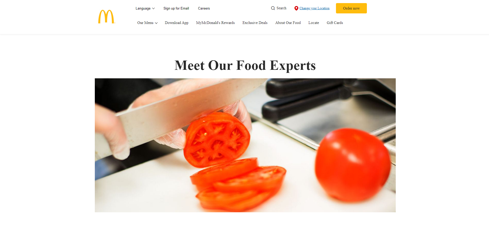

# McDonalds Clone

Creating a copy of the page `https://www.mcdonalds.com/us/en-us/about-our-food/meet-our-food-experts.html` using only JavaScript. Project is used to practice using different functions and standard methods in JavaScript, but also to get familiar with the concept of the DOM - Document Object Model. A project focused on designing the page using HTML and CSS is used as the template for how to create the design of the page. The actual page is then created using only JavaScript.

## Code structure

A basic html file is created and then the entire page is created in the `script.js` file. The code divides the page into several sections, where each section is then created by calling a function. This function calls other help functions locally defined inside the function responsible for creating the section. The concept of using nested functions is used to place the functions close to where they are being called. 
Below is an example of the code.

```js

// Creating array to store elements I want a listener for. 
const hoverObjects = [];
  

// --------- Run Section --------------


//Styling the body element
styleBody();

//Function calls to design each section of the page             
headerSection();
mainContentSection();
footerSection();

//Adding Eventlisteners to implement hover functionality 
eventListenersSetUp();

 
 //-----------------------------------------


// --------------- Design Functions for sections -------------------

...

function mainContentSection(){

  const mainContent = designMainContent();
  const childElements = [];
  
  childElements.push(designHeadline());
  childElements.push(designFoodImage());
  childElements.push(designDescription());
  childElements.push(designBottomSection())
  
  childElements.forEach(element =>{
    addChildElement(mainContent, element);
  });
  
  
  

  function designMainContent (){
    const mainContent = document.createElement('div');
     //Styling mainContent
    styles = [
      {id: 'padding-top', value: '100px'},
      {id: 'display', value: 'flex'},
      {id: 'flex-direction', value: 'column'},
      {id: 'align-items', value: 'center'}
    ];
    applyStyles(styles, mainContent);
    return mainContent;
 
  }

  function designHeadline(){
    const h1 = document.createElement('h1');
    h1.textContent = 'Meet Our Food Experts';
    let styles = [
      {id: 'font-weight', value: 'bold'},
      {id: 'font-size', value: '54px'},
      {id: 'padding', value: '0px'},
      {id: 'margin', value: '0px'},
      {id: 'margin-bottom', value: '20px'}
    ];
    applyStyles(styles, h1);
    return h1;
  }

  function designFoodImage(){
    const foodImage = document.createElement('img');
    foodImage.src = 'Images/food-image.jpg';
    return foodImage;
  }

...

```

Here we see some of the main patterns in the design. 
- We use an array to store child objects to a object. The child objects are then pushed into this array by calling a function that returns the desired object. 
- The basic idea is to create functions that return different elements that together build up the page element by element.
- We use functions calls to create the element. A help method `applyStyles` is used to apply styles to a object. The styles are passed to this function in an array of objects. 
- Everything is returned up to each parent element, which in turn is then returned back to its own parent element. This makes sure each element is added at the correct place. 
- The main idea is to divide the creation of the page into small functions with a well defined task.
- The code we see above is the start of creating the main section on the page, a similar functions is defined for creating other sections: `headerSection` and `footerSection`


### Layout of page
Below is a image over the layout on the page.




## Project Structure

The images in the project is put into a folder to keep the root folder clean.

```

Images/
  ...
.gitignore
index.html
README.md
script.js

```

## Technologies Used
- HTML
- CSS
- JavaScript